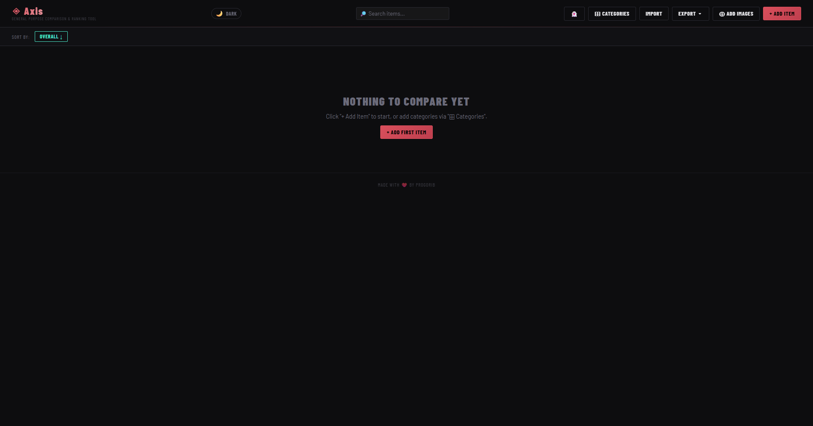

# Axis

**General-purpose comparison & ranking tool**



Axis is an open-source desktop application built with HTML, CSS, JavaScript, and Tauri that lets you compare, rank, and organize virtually anything.

Games, movies, anime, phones, PC hardware, books, cars — if it can be rated, it can be ranked.

---

## Features

- 📊 Custom ranking categories
- ⚖️ Side-by-side comparison mode
- 🏆 Dynamic ranking & podium system
- 🖼️ Multiple images per item
- 🔍 Search, tags & filters
- 📋 Category templates
- 📌 Favorites / pinned items
- 🌙 Dark & Light themes
- 📤 JSON & ZIP import/export
- 💾 Automatic backups
- 🖥️ Native desktop app via Tauri
- 🔒 Fully offline & privacy-friendly

---

## Built With

- HTML
- CSS
- JavaScript
- Tauri

### Required Tauri Plugins

```rust
tauri_plugin_opener
tauri_plugin_fs
tauri_plugin_dialog
```

---

## Development

```bash
npm install
npm run tauri dev
```

Build release:

```bash
npm run tauri build
```

---

## Project Structure

```text
Axis/
├── src/
│   ├── index.html
│   ├── storage.js
│   └── tauri-close-guard.js
├── src-tauri/
├── package.json
└── icon.png
```
## Recommended IDE Setup

- [VS Code](https://code.visualstudio.com/) + [Tauri](https://marketplace.visualstudio.com/items?itemName=tauri-apps.tauri-vscode) + [rust-analyzer](https://marketplace.visualstudio.com/items?itemName=rust-lang.rust-analyzer)

---

## License

This project is licensed under the MIT License - see the [LICENSE](LICENSE) file for details.
