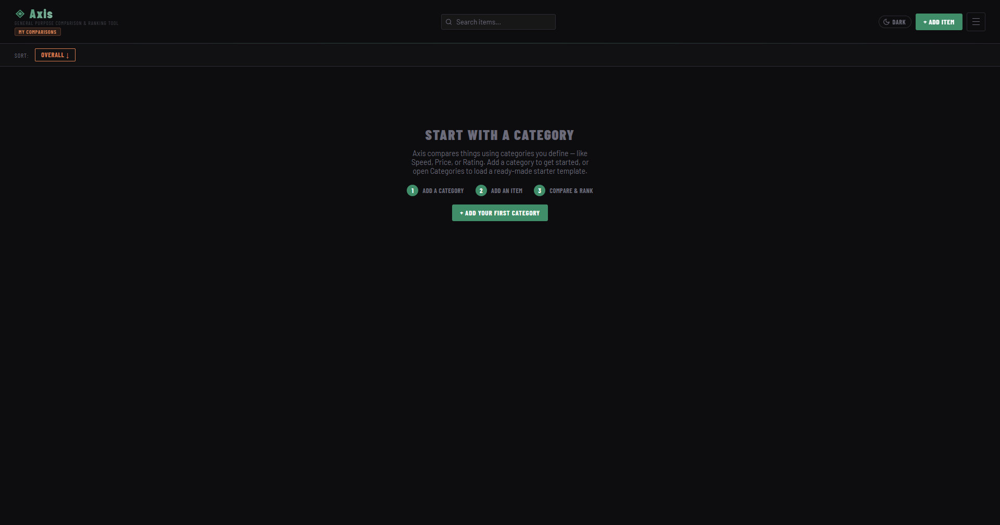
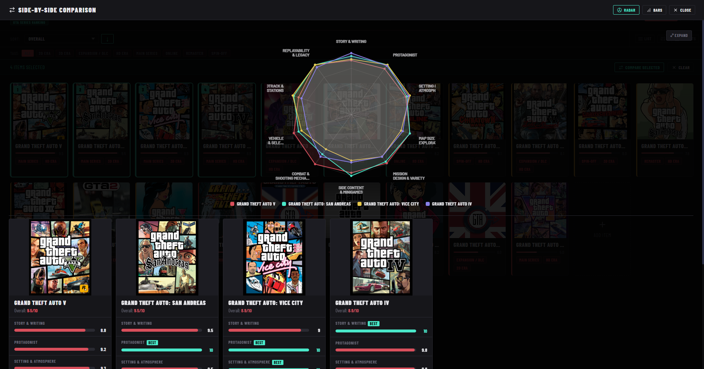
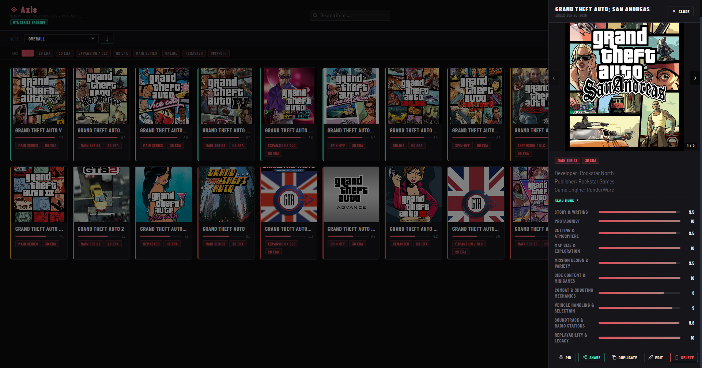
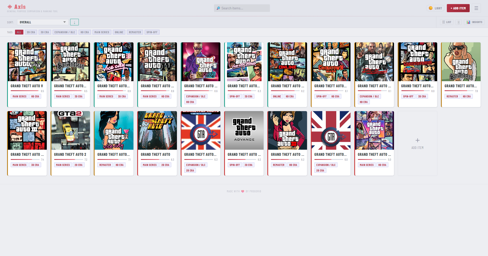
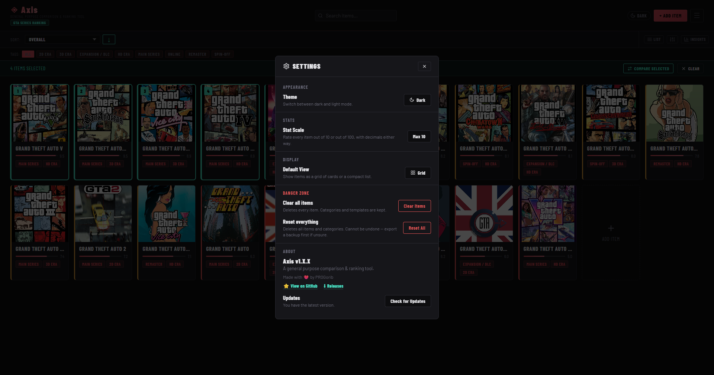
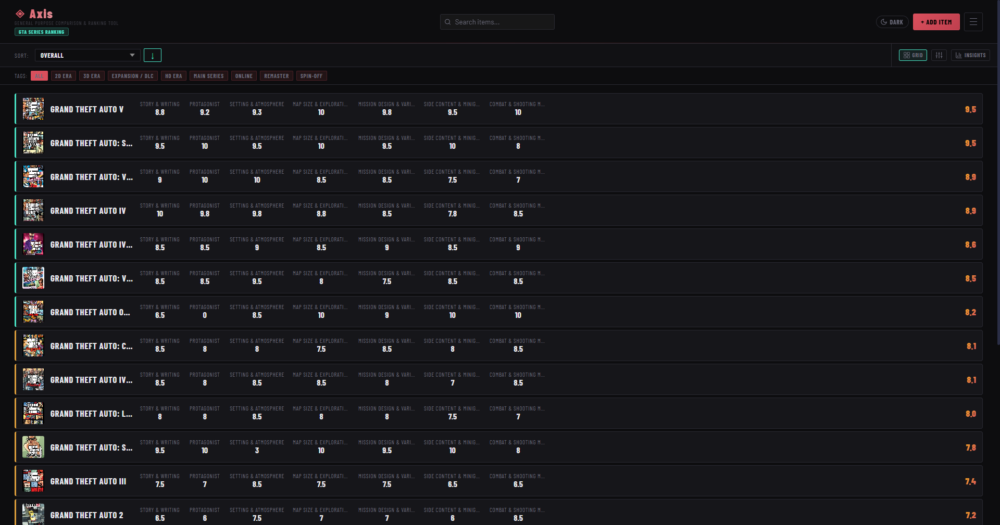

# Axis

**General-purpose comparison & ranking tool**

[](LICENSE)
[](https://tauri.app)
[](https://github.com/PR0Gorib/Axis/releases)



Axis is an open-source desktop application built with HTML, CSS, JavaScript, and Tauri that lets you compare, rank, and organize virtually anything.

Games, movies, anime, phones, PC hardware, books, cars — if it can be rated, it can be ranked.

---

## Download

Grab the latest build for your platform from the **[Releases page](https://github.com/PR0Gorib/Axis/releases)** — no build step required.

---

## Screenshots

<table>
  <tr>
    <td width="50%">
      <br>
      <sub><b>Side-by-side comparison with radar chart</b></sub>
    </td>
    <td width="50%">
      <br>
      <sub><b>Item detail panel — images, tags & stats</b></sub>
    </td>
  </tr>
  <tr>
    <td width="50%">
      <br>
      <sub><b>Light mode</b></sub>
    </td>
    <td width="50%">
      <br>
      <sub><b>Settings panel</b></sub>
    </td>
  </tr>
  <tr>
    <td width="50%">
      <br>
      <sub><b>Share-as-image export</b></sub>
    </td>
    <td width="50%">
      <br>
      <sub><b>List view</b></sub>
    </td>
  </tr>
</table>

---

# Features

- Custom ranking categories, with starter templates to get going quickly
- Multiple projects — keep separate comparison lists (e.g. Games, Movies, Restaurants) with their own items, categories, and backups
- Side-by-side comparison mode with radar and bar chart visualizations, plus a full-screen radar zoom for detailed reading
- Dynamic rankings, podiums & score tiers
- Search, tag filtering, and score-range filtering
- Advanced image manager (up to 5 images per item)
- Share individual items or full rankings as exported images — leaderboard exports support both list and grid layouts
- XLSX, JSON & ZIP import/export support, including bulk image import
- Bulk stat editing tools
- Automatic backups & restore manager
- Favorites / pinned items
- Keyboard shortcuts
- Dark & Light themes, three accent color pairings (Red/Teal, Plum/Amber, Forest/Terracotta) with a full UI-wide color overhaul per theme
- Smooth transitions throughout — animated re-ranking when you sort or filter, and a crossfade when switching between grid and list view
- Per-project stat scale — each project remembers its own 0–10 or 0–100 scoring range
- In-app update checker — notifies you when a newer release is available on GitHub
- Incognito mode for temporary, unsaved sessions
- Native desktop app via Tauri
- Fully offline & privacy-friendly

---

## Built With

- HTML
- CSS
- JavaScript
- [Tauri](https://github.com/tauri-apps/tauri)
- [SheetJS](https://sheetjs.com) — vendored library powering XLSX import/export

### Required Tauri Plugins

```rust
tauri_plugin_opener
tauri_plugin_fs
tauri_plugin_dialog
```

---

## Development

### Prerequisites

Before building from source, make sure you have:

- [Node.js](https://nodejs.org/) (LTS recommended)
- [Rust](https://www.rust-lang.org/tools/install) (stable toolchain)
- Platform-specific Tauri dependencies — see the [Tauri prerequisites guide](https://tauri.app/start/prerequisites/) for your OS (e.g. WebView2 on Windows, `webkit2gtk` on Linux)

### Setup

```bash
git clone https://github.com/PR0Gorib/Axis.git
cd Axis
npm install
npm run tauri dev
```

### Build a release

```bash
npm run tauri build
```

The built installer/binary will be under `src-tauri/target/release/`.

---

## Project Structure

```text
Axis/
├── src/
│   ├── index.html
│   ├── styles.css
│   ├── app.js
│   ├── storage.js
│   ├── tauri-close-guard.js
│   └── xlsx.full.min.js   # vendored SheetJS build — do not edit
├── src-tauri/
├── package.json
└── icon.png
```

---

## Recommended IDE Setup

- [VS Code](https://code.visualstudio.com/) + [Tauri](https://marketplace.visualstudio.com/items?itemName=tauri-apps.tauri-vscode) + [rust-analyzer](https://marketplace.visualstudio.com/items?itemName=rust-lang.rust-analyzer)

---

## Contributing

Issues and pull requests are welcome. If you're changing UI, please test both light and dark mode before submitting.

---

## License

This project is licensed under the MIT License - see the [LICENSE](LICENSE) file for details.
